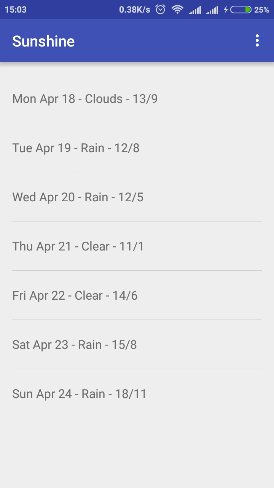

# Sunshine
Sunshine Project is Android Nanodegree Program Exercise Project , built as per instruction @ Udacity.com

This project displays , how to connect Open Weather Api , And Implement Listview

This Project Uses open weather map api , key is to be used placing it in gradle.properties file in users home directory gradle folder

